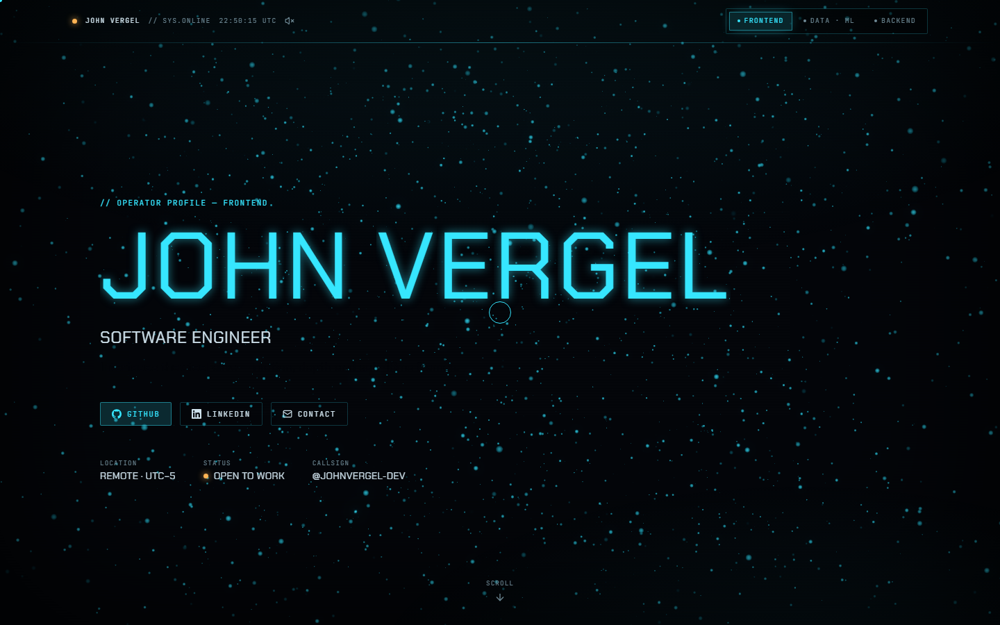
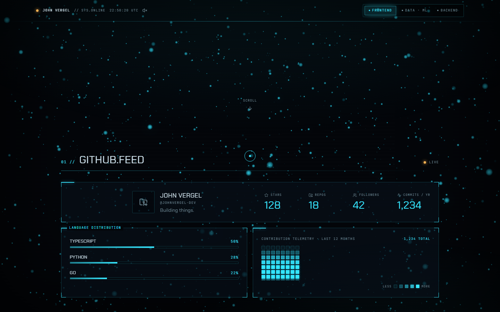
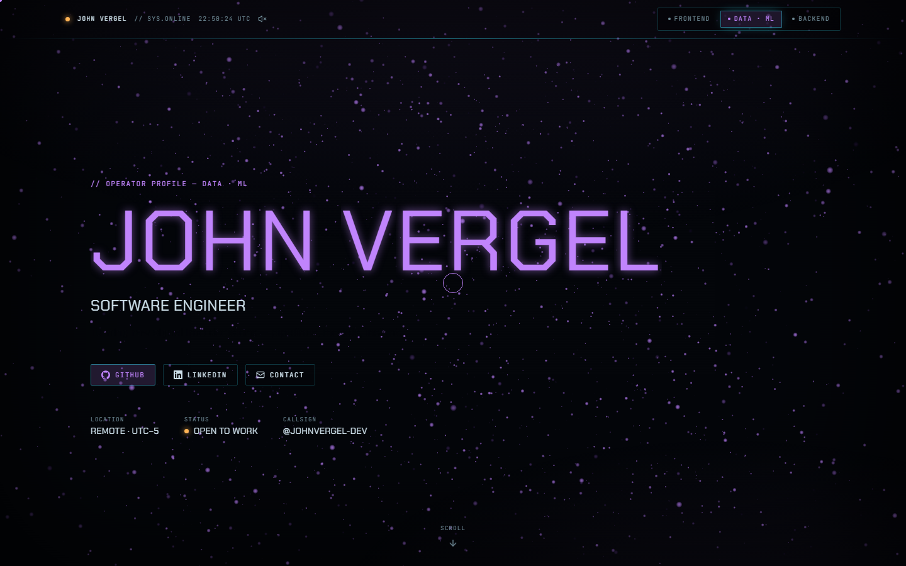

# Operator HUD — Sci‑Fi Interactive Portfolio

[](https://github.com/johnvergel-dev/portfolio/actions/workflows/ci.yml)
[](LICENSE)


A single‑page personal portfolio styled as a **futuristic cockpit / operations
HUD**. It boots like a system, reacts to cursor and scroll with real physics,
streams **live GitHub telemetry**, and ships a **loadout system** that
reconfigures the whole site per role (Frontend / Data‑ML / Backend) — shareable
via URL (`?perfil=data`) with a distinct preview image for each.

Built with Next.js 16 (App Router) + React 19 + TypeScript (strict), GSAP,
Lenis, react‑three‑fiber and Tailwind v4. 100% free stack, deploys on Vercel.

<!-- After deploying, add your live URL: **▶ Live demo: https://your-domain.vercel.app** -->



---

## Features

- **Boot sequence** → cinematic `INITIALIZING…` overlay with a progress wipe.
- **Apple‑style scroll** — Lenis inertia synced to GSAP ScrollTrigger; pinned
  hero with scale/blur, masked SplitText reveals, count‑up metrics, telemetry
  bars that fill in‑view, and a pinned **horizontal rail** for featured work.
- **Loadout system** — `?perfil=` drives content filtering, a smooth accent
  **retint**, the page `<title>`/description and a dynamic **OG image**. The
  last loadout is remembered via `localStorage`.
- **Live GitHub feed** — contributions heatmap, language distribution, top
  repos and headline metrics, fetched server‑side (token hidden) and cached.
- **Reactive WebGL background** — instanced particle shader responding to mouse,
  scroll and the active accent, with a Bloom pass and a 2D‑canvas fallback.
- **Premium interaction** — custom inertial cursor, 3D tilt cards, magnetic
  CTAs, and a "reconfiguration" scan‑line transition on loadout change.
- **Accessible + performant** — full `prefers-reduced-motion` support, keyboard
  navigable, AA contrast, lazy/code‑split WebGL, DPR cap, `next/font` (0 CLS).

---

## Screenshots

| GITHUB.FEED (live telemetry)    | Data‑ML loadout (retinted)             |
| ------------------------------- | -------------------------------------- |
|  |  |

---

## Quick start

```bash
npm install
cp .env.example .env.local   # optional, see below
npm run dev                  # http://localhost:3000
```

> Requires Node 18.18+ (Node 22 recommended).

The site works with **no configuration** — without a GitHub token it falls back
to the unauthenticated GitHub REST API (rate‑limited) and shows a discreet
banner.

---

## Environment variables

Copy `.env.example` → `.env.local` (git‑ignored). On Vercel, set these in
**Project → Settings → Environment Variables**.

| Variable               | Required | Purpose                                                                |
| ---------------------- | -------- | ---------------------------------------------------------------------- |
| `GITHUB_TOKEN`         | No\*     | Fine‑grained read‑only PAT. Enables the contributions heatmap + 5k/h.  |
| `NEXT_PUBLIC_SITE_URL` | No       | Absolute prod URL for canonical/OG/sitemap (only for a custom domain). |

\* Without it the feed still renders (repo stats via public REST), but the
contributions heatmap requires a token (GitHub's calendar is GraphQL‑only).

**Create a token:** GitHub → Settings → Developer settings →
[Fine‑grained tokens](https://github.com/settings/personal-access-tokens) →
_Public repositories (read‑only)_. No extra scopes are needed. The token is read
**only on the server** and never sent to the browser.

---

## Make it yours

All content is **typed data** in `data/` — components contain zero hardcoded
content. Search for `PLACEHOLDER` and replace.

### 1. Identity & links — `data/site.config.ts`

```ts
export const siteConfig: SiteConfig = {
  callsign: "JOHN VERGEL", // your display name (HUD callsign)  ← PLACEHOLDER
  title: "Software Engineer", //                                ← PLACEHOLDER
  location: "Remote · UTC−5", //                                ← PLACEHOLDER
  githubUser: "johnvergel-dev", // live GitHub handle (must exist)
  linkedinUrl: "https://www.linkedin.com/in/...", //            ← PLACEHOLDER
  email: "you@example.com",
  resumeUrl: undefined, // set a URL/PDF path to show the RESUME button
};
```

### 2. Content — `data/projects.ts`, `data/skills.ts`, `data/experience.ts`

Each item carries `tags: ProfileId[]` controlling which loadouts surface it.
`featured: true` projects sort first and appear in the horizontal rail.

> **Why experience is hand‑maintained:** LinkedIn has no free API for a personal
> profile's experience/education, and scraping violates its ToS. The log lives
> in `data/experience.ts`; the LINKEDIN button links out to the real profile.

### 3. Add a new loadout

1. Add the id to the `ProfileId` union in `types/index.ts`
   (e.g. `"frontend" | "data" | "backend" | "devops"`).
2. Append an entry in `data/profiles.ts` (label, tagline, `accent` hex,
   `ogHeadline`, `order`).
3. Tag projects/skills/experience with the new id.

That's it — the switcher, filtering, retint, metadata and OG image update
automatically.

### 4. Enable certifications

The `CertificationsModule` shows a **MODULE LOCKED** stub while
`data/certifications.ts` is empty. Just push real entries (with `tags`) to
activate it — no component changes.

---

## How the GitHub integration works

`app/api/github/route.ts` runs **server‑side**, reads `GITHUB_TOKEN`, and makes
two calls in parallel: GraphQL (contribution calendar + profile) and REST
(repos). It aggregates languages / top repos / totals and returns normalized
JSON typed in `lib/github.ts`. Errors degrade gracefully to
`RATE_LIMIT` / `USER_NOT_FOUND` / `OFFLINE` states the HUD renders.

The route is cached at the **route level** (`dynamic = "force-static"`,
`revalidate = 3600`) so GitHub is hit at most **once per hour** — a GraphQL
`POST` isn't eligible for the per‑request data cache, so the whole computed
response is cached instead. Because of `force-static`, the route always reports
the configured `siteConfig.githubUser` (the `?user=` query is intentionally
ignored).

---

## Scripts

| Script              | Description                                 |
| ------------------- | ------------------------------------------- |
| `npm run dev`       | Dev server (Turbopack).                     |
| `npm run build`     | Production build (+ type check).            |
| `npm run start`     | Serve the production build.                 |
| `npm run lint`      | ESLint.                                     |
| `npm run typecheck` | `tsc --noEmit`.                             |
| `npm run format`    | Prettier write.                             |
| `npm test`          | Playwright (smoke + a11y + reduced‑motion). |

### Testing

```bash
npm run build      # tests run against the production build
npm test           # first run also: npx playwright install chromium
```

Covers: load + loadout switch (URL + content + no console errors), live GitHub
module against a mocked API, axe accessibility (no serious/critical violations),
and reduced‑motion (boot skipped, reveals disabled, content reachable).

---

## Performance

Targets the brief's budget (Lighthouse mobile: Perf ≥ 90, A11y ≥ 95,
BP/SEO ≥ 95; 60fps desktop). Key measures: animate only
`transform`/`opacity`/`filter`; WebGL is `dynamic`/`ssr:false` + code‑split,
DPR‑capped (`[1, 1.75]`), and paused when the tab is hidden; touch and
reduced‑motion get a lightweight fallback; `next/font` with `display: swap` for
0 CLS. Run Lighthouse against a production build / the Vercel preview to verify
in your environment.

---

## Deploy to Vercel

[](<https://vercel.com/new/clone?repository-url=https%3A%2F%2Fgithub.com%2Fjohnvergel-dev%2Fportfolio&env=GITHUB_TOKEN&envDescription=Fine-grained%20read-only%20GitHub%20PAT%20for%20the%20live%20feed%20(optional)&project-name=operator-hud&repository-name=portfolio>)

1. Push this repo to GitHub.
2. Import it at [vercel.com/new](https://vercel.com/new) (framework auto‑detected).
3. Add `GITHUB_TOKEN` (and optionally `NEXT_PUBLIC_SITE_URL`) under Environment
   Variables.
4. Deploy. Every push auto‑deploys; PRs get preview deployments.

---

## Project structure

```
app/            layout, page (assembles by ?perfil), api/github, api/og, sitemap, robots
components/
  providers/    ProfileProvider (loadout state), SmoothScrollProvider (Lenis)
  fx/           Reveal, CountUp, Cursor, InteractionFX (tilt+magnetic), BootSequence, ReconfigureFX, AudioToggle
  scene/        Background, ParticleScene, ParticleField, StarfieldFallback
  hud/          Hero, TopBar, LoadoutSwitcher, GithubModule, Heatmap, Projects, SkillMatrix, ExperienceLog, Certifications, Footer
  ui/           Panel, Chip, MeterBar, SectionHeader, HudButton, EmptyState, BrandIcons
data/           profiles, projects, skills, experience, certifications, site.config  ← edit these
lib/            github (types + aggregation), filterByProfile, gsap, ease
hooks/          usePrefersReducedMotion, usePointerFine, useMediaQuery, useMounted
tests/          Playwright specs
```

---

Built with Next.js · GSAP · react‑three‑fiber · Tailwind. Sci‑fi HUD vibes. ▢
